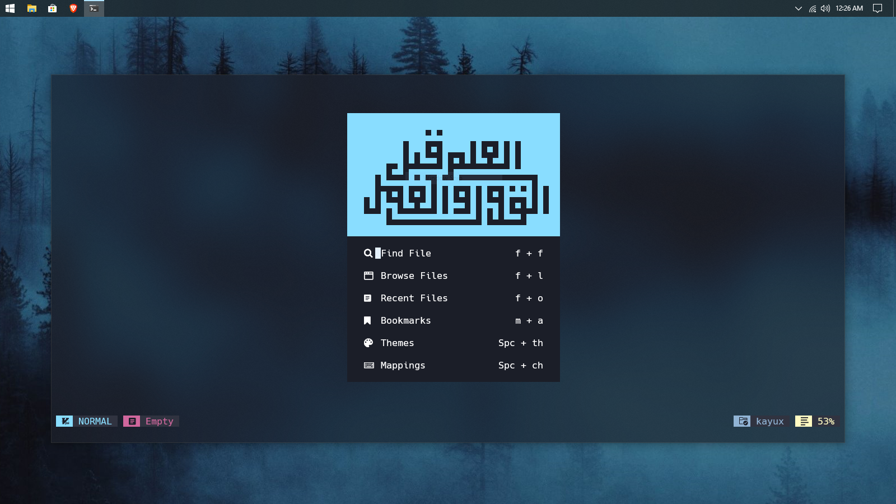
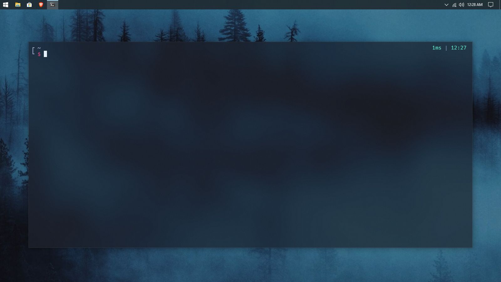
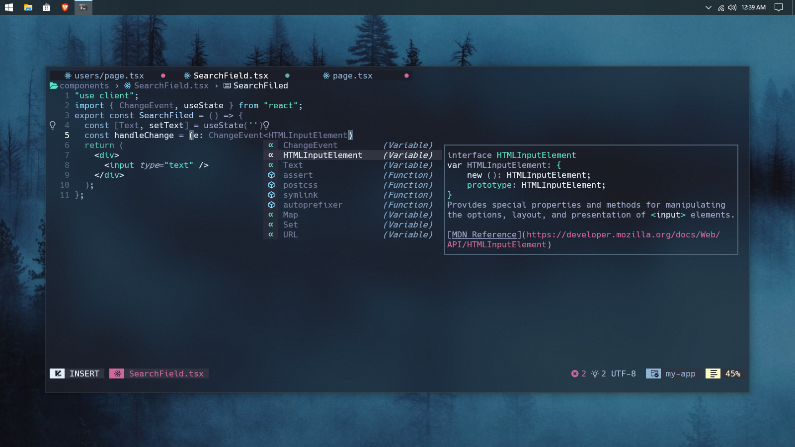
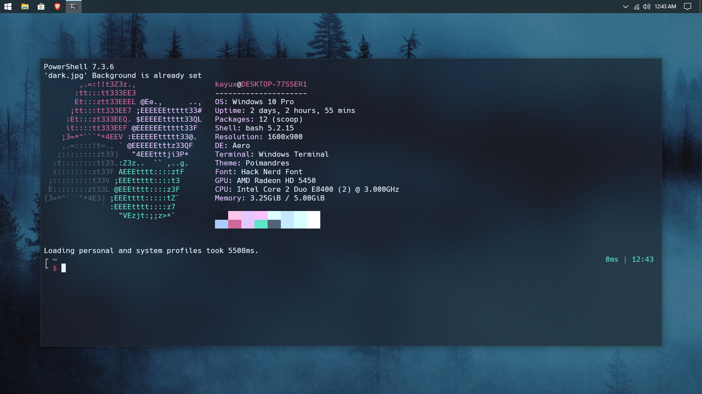

# kayux dotfiles

  

## tools

- Neovim
- Powershell
- PowerToys

## nvim

- [NvChad](https://github.com/nvchad/nvchad)
- [windwp/nvim-ts-autotag](https://github.com/windwp/nvim-ts-autotag)
- [nvimdev/lspsaga.nvim](https://github.com/nvimdev/lspsaga.nvim)
- [stevearc/oil.nvim](https://github.com/stevearc/oil.nvim)
- [tpope/vim-surround](https://github.com/tpope/vim-surround)
- [williamboman/mason-lspconfig.nvim](https://github.com/williamboman/mason-lspconfig.nvim)

## powershell

- [scoop](https://github.com/scoopinstaller/scoop) (Package manger)
- [git](https://github.com/git/git)
- [z](https://github.com/badmotorfinger/z)
- [neofetch](https://github.com/dylanaraps/neofetch)
